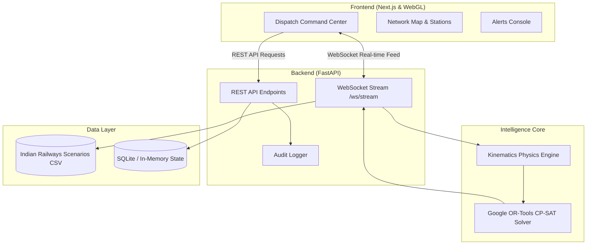

# 🛡️ AEGIS-RAIL: AI-Powered Real-Time Railway Conflict Prediction & Dispatch Engine

[](https://fastapi.tiangolo.com)
[](https://nextjs.org/)
[](https://developers.google.com/optimization)
[](https://tailwindcss.com)
[](https://python.org)

**Aegis-Rail** is a mission-critical, real-time railway traffic dispatch and conflict resolution platform. Designed for modern railway networks, it combines high-fidelity train kinematics simulation with Google OR-Tools constraint satisfaction algorithms to predict track contention, optimize throughput, preserve network momentum, and provide dispatch controllers with explainable, actionable decision intelligence.

---

## 📑 Table of Contents

- [Key Features](#-key-features)
- [System Architecture](#-system-architecture)
- [Core AI & Physics Modules](#-core-ai--physics-modules)
- [Project Structure](#-project-structure)
- [Getting Started](#-getting-started)
  - [Prerequisites](#prerequisites)
  - [Backend Setup](#1-backend-setup)
  - [Frontend Setup](#2-frontend-setup)
- [Environment Variables](#-environment-variables)
- [API & WebSocket Specifications](#-api--websocket-specifications)
- [License](#-license)

---

## ⚡ Key Features

- **Kinematics & Physics Engine**: Computes train deceleration, momentum ($p = mv$), and stopping distance ($d = v^2 / 2a$) across train classes (High-Speed, Express, Commuter, Freight, Heavy Freight).
- **Google OR-Tools AI Optimizer**: Constraint-programming (`cp_model`) solver to dynamically resolve bottleneck conflicts by maximizing preserved network momentum and preventing cascading schedule delays.
- **Bi-directional Live WebSocket Telemetry**: Streams scenario evaluation, sensor readings, and real-time train movement metrics over low-latency WebSockets.
- **Human-in-the-Loop Dispatch Console**: Real-time decision interface featuring countdown timers, one-click clearance/diversion approval, emergency overrides, and speed gauges.
- **Automated Anomaly & Collision Warnings**: Detection of speed violations, critical block overlaps, and automated issue dispatching.
- **SIH Audit Trail Compliance**: Cryptographic / timestamped logging for controller approvals and audit compliance.
- **Station Manifests & Network Monitoring**: Live dashboards covering station track manifests, active trains, and network-wide KPIs.

---

## 🏗️ System Architecture



---

## 🧠 Core AI & Physics Modules

### 1. Kinematics Physics Engine (`backend/ai_engine/kinematics.py`)
Computes realistic physical limits for dynamic brake application and momentum:
- **Stopping Distance ($d$)**:
  $$\text{Speed (m/s)} = v_{\text{km/h}} \times \frac{5}{18}, \quad d = \frac{v^2}{2a}$$
  *Deceleration rates ($a$): High-Speed (1.2 m/s²), Express (0.8 m/s²), Commuter (1.0 m/s²), Freight (0.5 m/s²), Heavy Freight (0.4 m/s²).*
- **Momentum ($p$)**:
  $$p = m_{\text{kg}} \times v_{\text{m/s}}$$

### 2. Constraint Programming Optimizer (`backend/ai_engine/optimizer.py`)
Uses Google OR-Tools CP-SAT solver:
- **Bottleneck Invariant**: Guarantees mutually exclusive track occupancy at single-line switches and junction bottlenecks ($t_1 + t_2 = 1$).
- **Objective Function**: Maximizes total preserved network momentum:
  $$\max \left( t_1 \cdot \text{momentum}_1 + t_2 \cdot \text{momentum}_2 \right)$$

---

## 📂 Project Structure

```text
aegis-rail/
├── backend/
│   ├── ai_engine/
│   │   ├── kinematics.py         # Physics & stopping distance calculations
│   │   └── optimizer.py          # Google OR-Tools constraint conflict solver
│   ├── app/
│   │   ├── database.py           # Database connection & session setup
│   │   ├── models.py             # SQLAlchemy models (Train, Schedule, Telemetry)
│   │   ├── schemas.py            # Pydantic schemas for data transfer
│   │   ├── websocket_manager.py  # WebSocket connection manager
│   │   └── routers/              # Modular API endpoints (trains, stations, alerts)
│   ├── data/
│   │   ├── indian_railways_logs.csv # Scenario test database (500+ scenarios)
│   │   └── historical_logs.csv      # Historical fallback log records
│   ├── seed_data.py              # Synthetic Indian Railways scenario generator
│   ├── main.py                   # FastAPI server entry point & WebSocket handler
│   └── requirements.txt          # Python dependencies
│
├── frontend/
│   ├── app/
│   │   ├── page.jsx              # Main Aegis Command Center (Overview)
│   │   ├── dashboard/            # Main Network Map
│   │   ├── stations/             # Station manifests and Gantt timeline
│   │   ├── alerts/               # Issue management & manual alert console
│   │   ├── trains/[id]/          # Detailed train telemetry view
│   │   ├── layout.jsx            # App root layout with Navbar & Footer
│   │   └── globals.css           # Global theme styles
│   ├── components/
│   │   ├── Aurora.jsx            # WebGL Aurora dynamic background shader
│   │   ├── BorderGlow.jsx        # Cyberpunk animated card border glow
│   │   ├── Speedometer.jsx       # SVG gauge speed & telemetry visualizer
│   │   ├── Navbar.jsx            # Top navigation bar
│   │   └── Footer.jsx            # Dispatch status footer
│   ├── package.json              # Frontend dependencies and scripts
│   └── tailwind.config.js        # Custom theme configuration
│
└── README.md
```

---

## 🚀 Getting Started

### Prerequisites
- **Python**: 3.10 or later
- **Node.js**: 18.x or later
- **npm** or **yarn** / **pnpm**

---

### 1. Backend Setup

```bash
# Navigate to the backend directory
cd backend

# Create and activate a virtual environment
python -m venv venv

# Windows:
.\venv\Scripts\activate
# Linux/macOS:
source venv/bin/activate

# Install dependencies
pip install -r requirements.txt

# (Optional) Generate/refresh scenario data
python seed_data.py

# Start the FastAPI server
uvicorn main:app --reload --host 0.0.0.0 --port 8000
```
The backend will be live at `http://localhost:8000`. API documentation is available at `http://localhost:8000/docs`.

---

### 2. Frontend Setup

```bash
# Open a new terminal and navigate to the frontend directory
cd frontend

# Install Node dependencies
npm install

# Start the Next.js development server
npm run dev
```
Open [http://localhost:3000](http://localhost:3000) in your browser to view the Aegis-Rail Command Center.

---

## ⚙️ Environment Variables

### Frontend (`frontend/.env.local` or environment):

| Variable | Description | Default |
| :--- | :--- | :--- |
| `NEXT_PUBLIC_API_URL` | Base URL for FastAPI REST backend | `http://localhost:8000` |
| `NEXT_PUBLIC_WS_URL` | WebSocket URL for live scenario streaming | `ws://localhost:8000/ws/stream` |

---

## 📡 API & WebSocket Specifications

### REST Endpoints

| Method | Endpoint | Description |
| :--- | :--- | :--- |
| `GET` | `/api/v1/alerts` | Fetches active and resolved safety alerts |
| `POST` | `/api/v1/alerts/trigger` | Triggers a new manual/system alert |
| `GET` | `/api/v1/kpi` | Returns macro network KPIs & throughput metrics |
| `POST` | `/api/v1/audit/approve` | Logs controller dispatch decision for audit trail |
| `GET` | `/api/v1/stations` | Retrieves station schedules and manifests |
| `GET` | `/api/v1/trains` | Retrieves train list with current telemetry |

### WebSocket Channel

- **Endpoint**: `ws://localhost:8000/ws/stream`
- **Protocol**:
  - Send message: `"NEXT"` to pull the next scenario.
  - Receive message:
    ```json
    {
      "status": "success",
      "scenario": {
        "scenario_id": 1,
        "train_1_id": "Vande Bharat Express (11420)",
        "train_1_type": "High_Speed",
        "train_1_weight": 430.0,
        "train_1_speed": 130.0,
        "train_2_id": "WAG-12 Heavy Freight (12045)",
        "train_2_type": "Heavy Freight",
        "train_2_weight": 6000.0,
        "train_2_speed": 75.0,
        "location": "Itarsi Junction",
        "delay_risk": "High"
      },
      "ai_recommendation": "OR-TOOLS OPTIMAL: Clear WAG-12 Heavy Freight (12045) on main line...",
      "priority_train": "WAG-12 Heavy Freight (12045)",
      "telemetry_data": {
        "Vande Bharat Express (11420)": {
          "stopping_distance_meters": 542.87,
          "momentum_kg_ms": "1.55e+07"
        },
        "WAG-12 Heavy Freight (12045)": {
          "stopping_distance_meters": 542.53,
          "momentum_kg_ms": "1.25e+08"
        }
      }
    }
    ```

---

## 🛡️ License

This project is developed for railway dispatch automation and research. Distributed under the MIT License.
