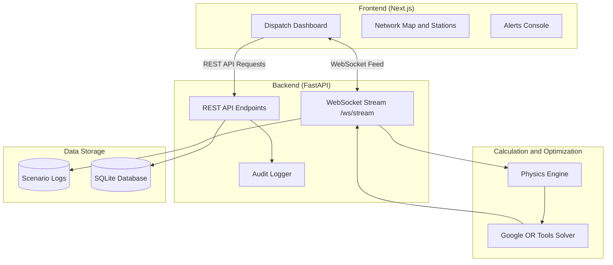

# Axolotl

An AI powered system that predicts railway track conflicts and helps dispatchers route trains smoothly with fewer delays.

---

## Overview

Axolotl is a railway traffic management tool built to assist train dispatchers. When multiple trains approach the same track, junction, or station bottleneck, Axolotl calculates train speed, weight, and braking distance, then uses optimization algorithms to recommend which train should go first. This helps minimize total stoppage time and keeps trains moving safely.

---

## Table of Contents

- [Overview](#overview)
- [How It Works](#how-it-works)
- [Key Features](#key-features)
- [System Architecture](#system-architecture)
- [Project Structure](#project-structure)
- [Getting Started](#getting-started)
  - [Prerequisites](#prerequisites)
  - [Backend Setup](#backend-setup)
  - [Frontend Setup](#frontend-setup)
- [Environment Configuration](#environment-configuration)
- [API and WebSocket Reference](#api-and-websocket-reference)
- [License](#license)

---

## How It Works

1. **Calculates Braking and Stopping Distance**: Uses standard physics formulas to estimate how far each train takes to stop based on its weight, speed, and train category.
2. **Finds the Best Route**: Uses the Google OR Tools solver to evaluate track bottlenecks and choose the sequence of trains that causes the least delay across the network.
3. **Streams Live Updates**: Sends train updates and routing suggestions directly to the web dashboard in real time over WebSockets.
4. **Keeps Human Dispatchers in Control**: Dispatchers can review recommendations, approve routing actions, trigger emergency overrides, and monitor active alerts.

---

## Key Features

- **Train Physics Calculations**: Accurately calculates stopping distances and movement momentum for high speed, express, commuter, and freight trains.
- **Automated Conflict Resolution**: Analyzes track bottlenecks and recommends optimal train priority order.
- **Live Dispatch Dashboard**: Web based interface showing active trains, speed gauges, station timelines, and routing alerts.
- **Manual Control and Approvals**: Dispatchers can accept recommendations with a single click or issue manual safety overrides.
- **Speed and Safety Alerts**: Flags overspeeding, route conflicts, and track maintenance issues automatically.
- **Station Schedules and Manifests**: Displays station track allocations and train arrival times.

---

## System Architecture



---

## Project Structure

```text
axolotl/
├── backend/
│   ├── ai_engine/
│   │   ├── kinematics.py         # Train physics and stopping distance calculations
│   │   └── optimizer.py          # Google OR Tools conflict solver
│   ├── app/
│   │   ├── database.py           # Database connection and session setup
│   │   ├── models.py             # Database models for trains, schedules, and alerts
│   │   ├── schemas.py            # Data validation schemas
│   │   ├── websocket_manager.py  # WebSocket connection manager
│   │   └── routers/              # API endpoints for trains, stations, and alerts
│   ├── data/
│   │   ├── indian_railways_logs.csv # Scenario dataset
│   │   └── historical_logs.csv      # Fallback log records
│   ├── seed_data.py              # Sample scenario generator script
│   ├── main.py                   # FastAPI application entry point
│   └── requirements.txt          # Python dependencies
│
├── frontend/
│   ├── app/
│   │   ├── page.jsx              # Main Axolotl dispatch overview
│   │   ├── dashboard/            # Network map
│   │   ├── stations/             # Station manifests and schedule timeline
│   │   ├── alerts/               # Alert management console
│   │   ├── trains/[id]/          # Detailed train information view
│   │   ├── layout.jsx            # Common application layout
│   │   └── globals.css           # Styling rules
│   ├── components/
│   │   ├── Navbar.jsx            # Top navigation bar
│   │   ├── Footer.jsx            # Bottom footer
│   │   ├── Speedometer.jsx       # Train speed gauge
│   │   ├── Aurora.jsx            # Background visualizer
│   │   └── BorderGlow.jsx        # Card component
│   ├── package.json              # Frontend package configuration
│   └── tailwind.config.js        # CSS styling configuration
│
└── README.md
```

---

## Getting Started

### Prerequisites

- Python 3.10 or later
- Node.js 18 or later
- npm or yarn

---

### Backend Setup

1. Open a terminal and change to the backend folder:
   ```bash
   cd backend
   ```

2. Create and activate a Python virtual environment:
   ```bash
   # On Windows:
   python -m venv venv
   .\venv\Scripts\activate

   # On macOS or Linux:
   python3 -m venv venv
   source venv/bin/activate
   ```

3. Install required Python packages:
   ```bash
   pip install -r requirements.txt
   ```

4. Optional: Generate sample scenario data:
   ```bash
   python seed_data.py
   ```

5. Run the backend server:
   ```bash
   uvicorn main:app --reload --host 0.0.0.0 --port 8000
   ```

The backend API will run at `http://localhost:8000`. Interactive API documentation is available at `http://localhost:8000/docs`.

---

### Frontend Setup

1. Open a new terminal and change to the frontend folder:
   ```bash
   cd frontend
   ```

2. Install Node dependencies:
   ```bash
   npm install
   ```

3. Start the frontend development server:
   ```bash
   npm run dev
   ```

Open `http://localhost:3000` in your web browser to access the dashboard.

---

## Environment Configuration

You can configure the frontend API and WebSocket URLs in `frontend/.env.local` or through environment variables:

| Variable | Description | Default Value |
| :--- | :--- | :--- |
| `NEXT_PUBLIC_API_URL` | Base URL for the FastAPI backend | `http://localhost:8000` |
| `NEXT_PUBLIC_WS_URL` | WebSocket URL for live scenario streaming | `ws://localhost:8000/ws/stream` |

---

## API and WebSocket Reference

### REST Endpoints

| Method | Endpoint | Description |
| :--- | :--- | :--- |
| `GET` | `/api/v1/alerts` | Returns active and resolved safety alerts |
| `POST` | `/api/v1/alerts/trigger` | Creates a new manual or system alert |
| `GET` | `/api/v1/kpi` | Returns network statistics and active train counts |
| `POST` | `/api/v1/audit/approve` | Records dispatcher approval actions |
| `GET` | `/api/v1/stations` | Returns station schedules and platform track usage |
| `GET` | `/api/v1/trains` | Returns train list and current speed metrics |

### WebSocket Endpoint

- **Address**: `ws://localhost:8000/ws/stream`
- **Usage**:
  - Send the text message `"NEXT"` to load the next conflict scenario.
  - The server replies with scenario details, braking metrics, and recommended dispatch decisions.

---

## License

This project is open source and available under the MIT License.
